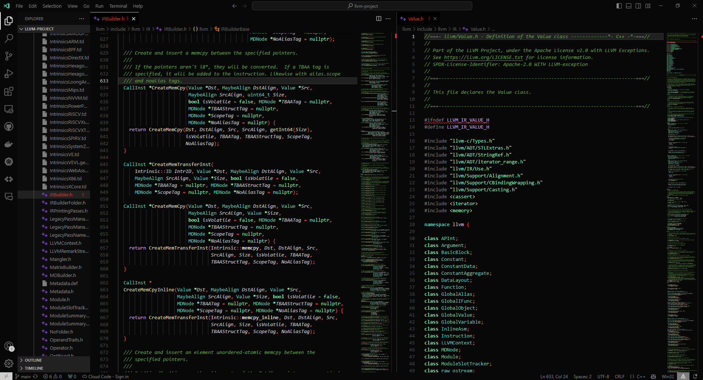

A modified version of <a href='https://marketplace.visualstudio.com/items?itemName=Nimda.deepdark-material'>Nimda's Deepdark Material Theme</a> for VS Code to more closely match the colors in his <a href='https://marketplace.visualstudio.com/items?itemName=Nimda.vs-deepdark-material'>Deepdark Material Theme for Visual Studio</a>.  

I edited the styling of his theme for C++ development. I haven't really made changes for other languages at the moment. 

Italics and bold styling has been added too, in similar fashion to the Red default theme.

